# 4. Flowcharts — How Everything Moves

> **Read time:** about 15 minutes
> **Before this:** [3. Design System](./03-DESIGN-SYSTEM.md) · **Next:** [5. Directory Map](./05-DIRECTORY-MAP.md)

Every chart below is written in **Mermaid**. GitHub shows them as diagrams automatically. In VS Code, install a Mermaid preview extension to see them.

**How to read the shapes:**

| Shape | Meaning |
|---|---|
| Rectangle `[ ]` | A step or a screen |
| Diamond `{ }` | A question / decision |
| Rounded `( )` | Start or end |
| Cylinder `[( )]` | Saved data |

---

## Contents

**The app**
1. [System overview](#1-system-overview)
2. [Pages and how they connect](#2-pages-and-how-they-connect)
3. [First visit and returning visit](#3-first-visit-and-returning-visit)
4. [Opening the Builder](#4-opening-the-builder)

**Keeping your work safe**

5. [Creating a new resume (the confirmation dialog)](#5-creating-a-new-resume-the-confirmation-dialog)
6. [Ways to start a resume](#6-ways-to-start-a-resume)
7. [Autosave](#7-autosave)
8. [The save status](#8-the-save-status)
9. [Refresh, Back, and closing the tab](#9-refresh-back-and-closing-the-tab)
10. [Recovering unsaved changes](#10-recovering-unsaved-changes)
11. [Two tabs editing the same resume](#11-two-tabs-editing-the-same-resume)
12. [Version history](#12-version-history)
13. [Undo and redo](#13-undo-and-redo)
14. [My Resumes actions](#14-my-resumes-actions)
15. [Backups: export and import](#15-backups-export-and-import)
16. [Moving the old single draft](#16-moving-the-old-single-draft)

**Editing and output**

17. [Sections: order, hide, and draw](#17-sections-order-hide-and-draw)
18. [Importing a PDF resume](#18-importing-a-pdf-resume)
19. [Downloading the PDF](#19-downloading-the-pdf)

**AI and tools**

20. [AI suggestion approval](#20-ai-suggestion-approval)
21. [AI polish for the whole resume](#21-ai-polish-for-the-whole-resume)
22. [Resume Analyzer](#22-resume-analyzer)
23. [Job Matcher and the tailored copy](#23-job-matcher-and-the-tailored-copy)
24. [The permission token](#24-the-permission-token)
25. [GitHub Projects](#25-github-projects)
26. [Interview Prep](#26-interview-prep)

**The server**

27. [Inside the AI route](#27-inside-the-ai-route)
28. [Rate limits](#28-rate-limits)
29. [AI model retry and fallback](#29-ai-model-retry-and-fallback)

---

## 1. System overview

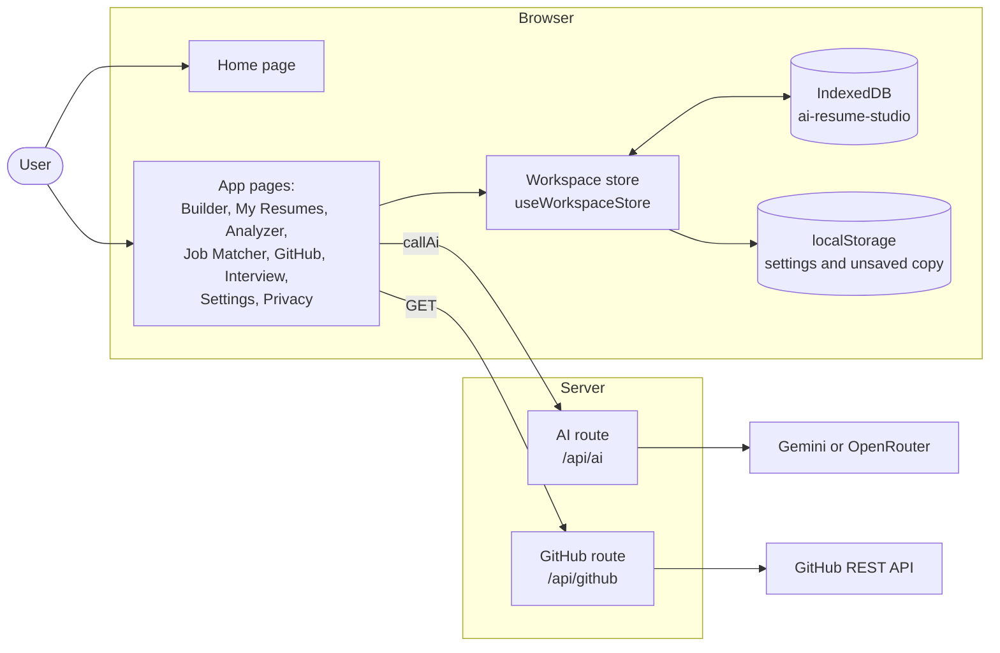
```mermaid
flowchart LR
    U(["User"]) --> HOME["Home page"]
    U --> APP["App pages:<br/>Builder, My Resumes, Analyzer,<br/>Job Matcher, GitHub, Interview,<br/>Settings, Privacy"]

    subgraph Browser
        HOME
        APP
        STORE["Workspace store<br/>useWorkspaceStore"]
        DB[("IndexedDB<br/>ai-resume-studio")]
        LS[("localStorage<br/>settings and unsaved copy")]
    end

    APP --> STORE
    STORE <--> DB
    STORE --> LS

    subgraph Server
        AI["AI route<br/>/api/ai"]
        GH["GitHub route<br/>/api/github"]
    end

    APP -->|"callAi"| AI
    APP -->|"GET"| GH
    AI --> PROV["Gemini or OpenRouter"]
    GH --> GHAPI["GitHub REST API"]
```

---

## 2. Pages and how they connect

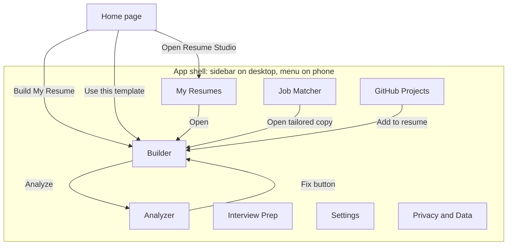
```mermaid
flowchart TD
    HOME["Home page"] -->|"Build My Resume"| B["Builder"]
    HOME -->|"Open Resume Studio"| R["My Resumes"]
    HOME -->|"Use this template"| B

    subgraph Shell["App shell: sidebar on desktop, menu on phone"]
        B
        R
        AN["Analyzer"]
        JM["Job Matcher"]
        GHP["GitHub Projects"]
        IV["Interview Prep"]
        ST["Settings"]
        PR["Privacy and Data"]
    end

    R -->|"Open"| B
    AN -->|"Fix button"| B
    JM -->|"Open tailored copy"| B
    GHP -->|"Add to resume"| B
    B -->|"Analyze"| AN
```

---

## 3. First visit and returning visit

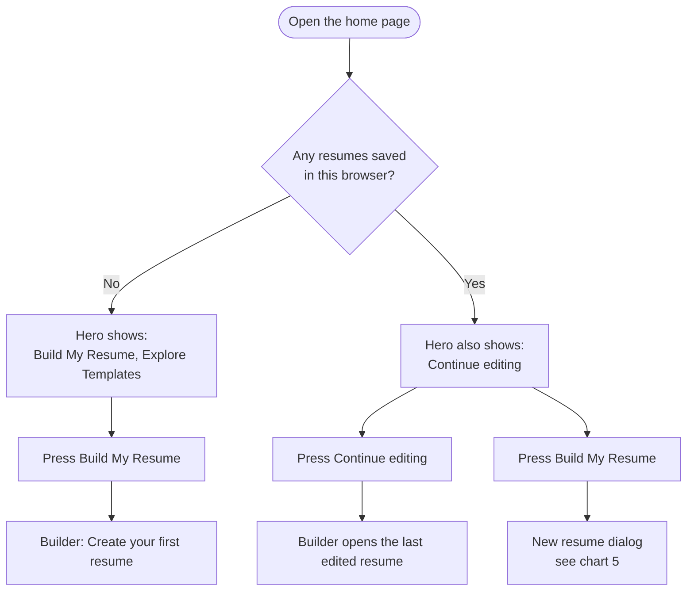
```mermaid
flowchart TD
    A(["Open the home page"]) --> B{"Any resumes saved<br/>in this browser?"}
    B -->|No| C["Hero shows:<br/>Build My Resume, Explore Templates"]
    B -->|Yes| D["Hero also shows:<br/>Continue editing"]
    C --> E["Press Build My Resume"]
    E --> F["Builder: Create your first resume"]
    D --> G["Press Continue editing"]
    G --> H["Builder opens the last edited resume"]
    D --> I["Press Build My Resume"]
    I --> J["New resume dialog<br/>see chart 5"]
```

---

## 4. Opening the Builder

The Builder always picks the same resume for the same address, so a refresh never creates a blank resume.

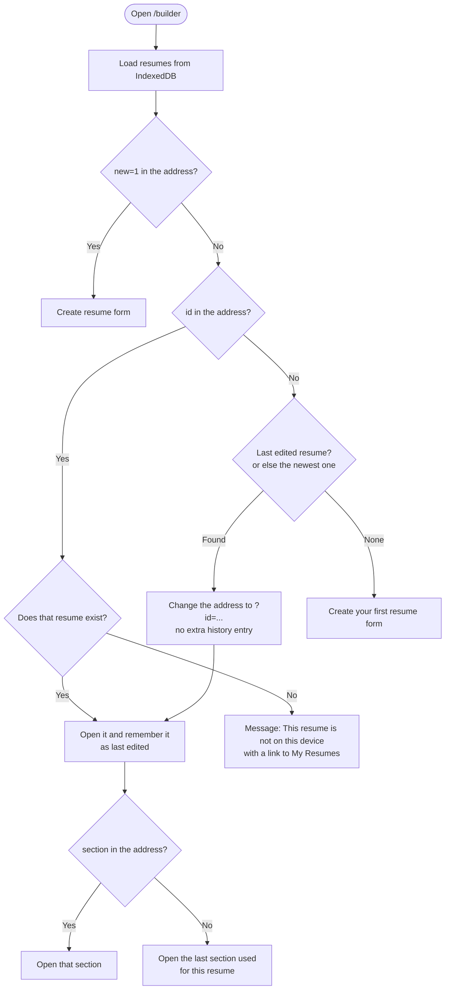
```mermaid
flowchart TD
    A(["Open /builder"]) --> L["Load resumes from IndexedDB"]
    L --> N{"new=1 in the address?"}
    N -->|Yes| FORM["Create resume form"]
    N -->|No| I{"id in the address?"}
    I -->|Yes| E{"Does that resume exist?"}
    E -->|Yes| OPEN["Open it and remember it<br/>as last edited"]
    E -->|No| NF["Message: This resume is not on this device<br/>with a link to My Resumes"]
    I -->|No| LAST{"Last edited resume?<br/>or else the newest one"}
    LAST -->|Found| REP["Change the address to ?id=...<br/>no extra history entry"]
    REP --> OPEN
    LAST -->|None| FIRST["Create your first resume form"]
    OPEN --> SEC{"section in the address?"}
    SEC -->|Yes| S1["Open that section"]
    SEC -->|No| S2["Open the last section used<br/>for this resume"]
```

---

## 5. Creating a new resume (the confirmation dialog)

Creating a resume **never** replaces another one.

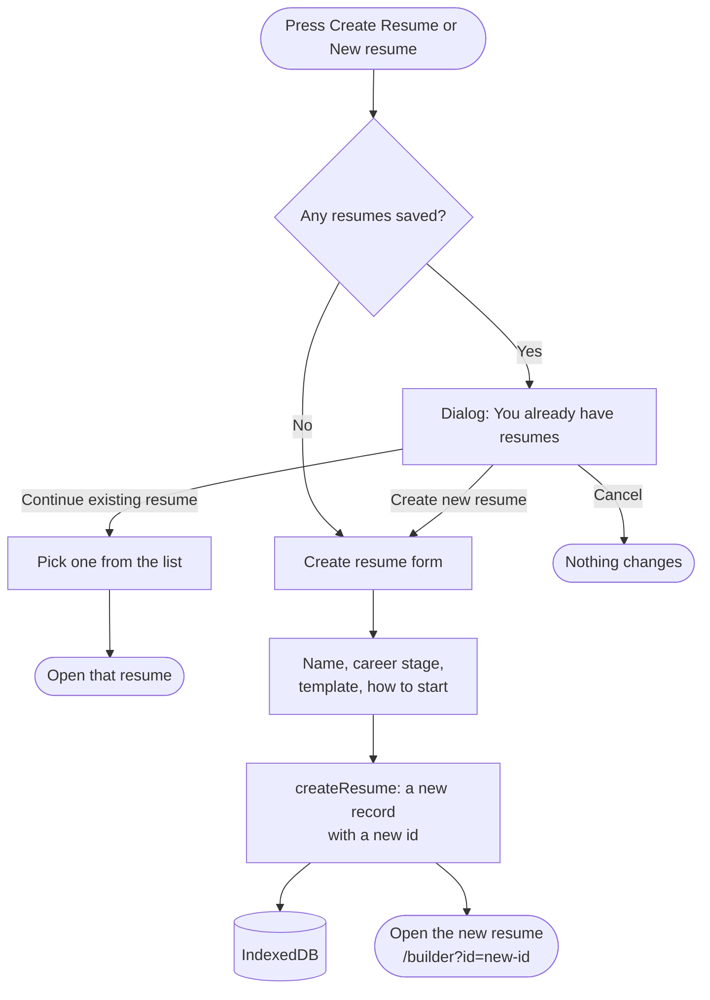
```mermaid
flowchart TD
    A(["Press Create Resume or New resume"]) --> B{"Any resumes saved?"}
    B -->|No| FORM["Create resume form"]
    B -->|Yes| D["Dialog: You already have resumes"]
    D -->|"Continue existing resume"| P["Pick one from the list"]
    P --> O(["Open that resume"])
    D -->|"Create new resume"| FORM
    D -->|"Cancel"| X(["Nothing changes"])
    FORM --> NAME["Name, career stage,<br/>template, how to start"]
    NAME --> C["createResume: a new record<br/>with a new id"]
    C --> DB[("IndexedDB")]
    C --> O2(["Open the new resume<br/>/builder?id=new-id"])
```

---

## 6. Ways to start a resume

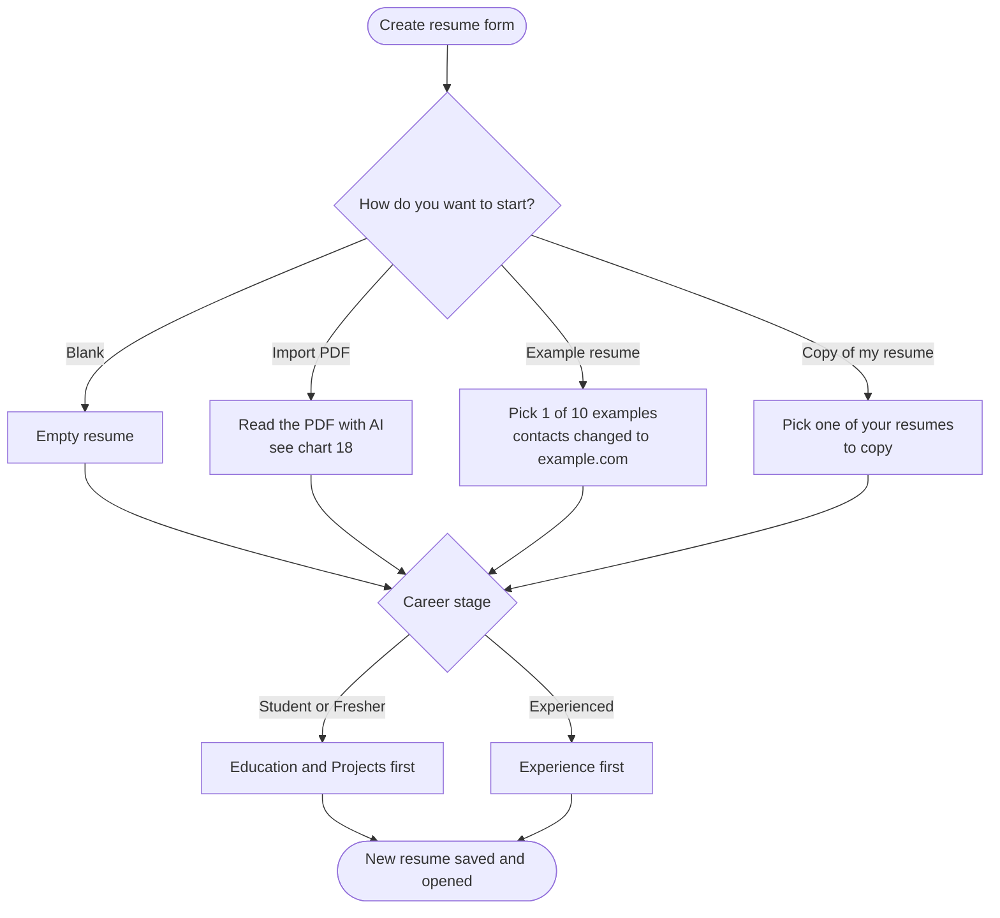
```mermaid
flowchart TD
    A(["Create resume form"]) --> W{"How do you want to start?"}
    W -->|Blank| B["Empty resume"]
    W -->|"Import PDF"| P["Read the PDF with AI<br/>see chart 18"]
    W -->|"Example resume"| S["Pick 1 of 10 examples<br/>contacts changed to example.com"]
    W -->|"Copy of my resume"| C["Pick one of your resumes<br/>to copy"]
    B --> STAGE
    P --> STAGE
    S --> STAGE
    C --> STAGE
    STAGE{"Career stage"} -->|"Student or Fresher"| F["Education and Projects first"]
    STAGE -->|"Experienced"| X["Experience first"]
    F --> NEW(["New resume saved and opened"])
    X --> NEW
```

---

## 7. Autosave

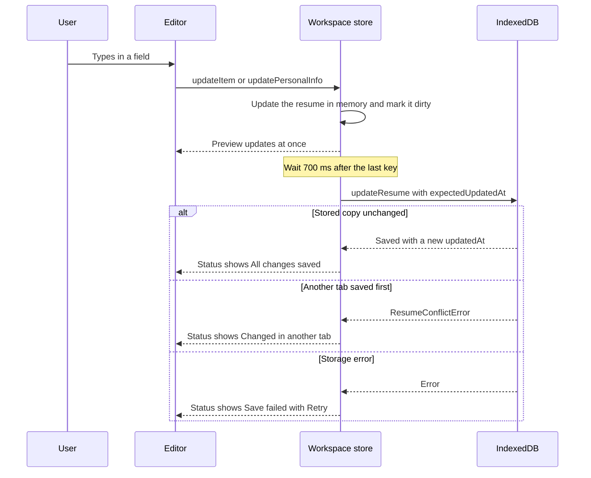
```mermaid
sequenceDiagram
    participant U as User
    participant E as Editor
    participant S as Workspace store
    participant DB as IndexedDB

    U->>E: Types in a field
    E->>S: updateItem or updatePersonalInfo
    S->>S: Update the resume in memory and mark it dirty
    S-->>E: Preview updates at once
    Note over S: Wait 700 ms after the last key
    S->>DB: updateResume with expectedUpdatedAt
    alt Stored copy unchanged
        DB-->>S: Saved with a new updatedAt
        S-->>E: Status shows All changes saved
    else Another tab saved first
        DB-->>S: ResumeConflictError
        S-->>E: Status shows Changed in another tab
    else Storage error
        DB-->>S: Error
        S-->>E: Status shows Save failed with Retry
    end
```

Adding, deleting, or moving items, and changing the template or section order, save **immediately** instead of waiting 700 ms.

---

## 8. The save status

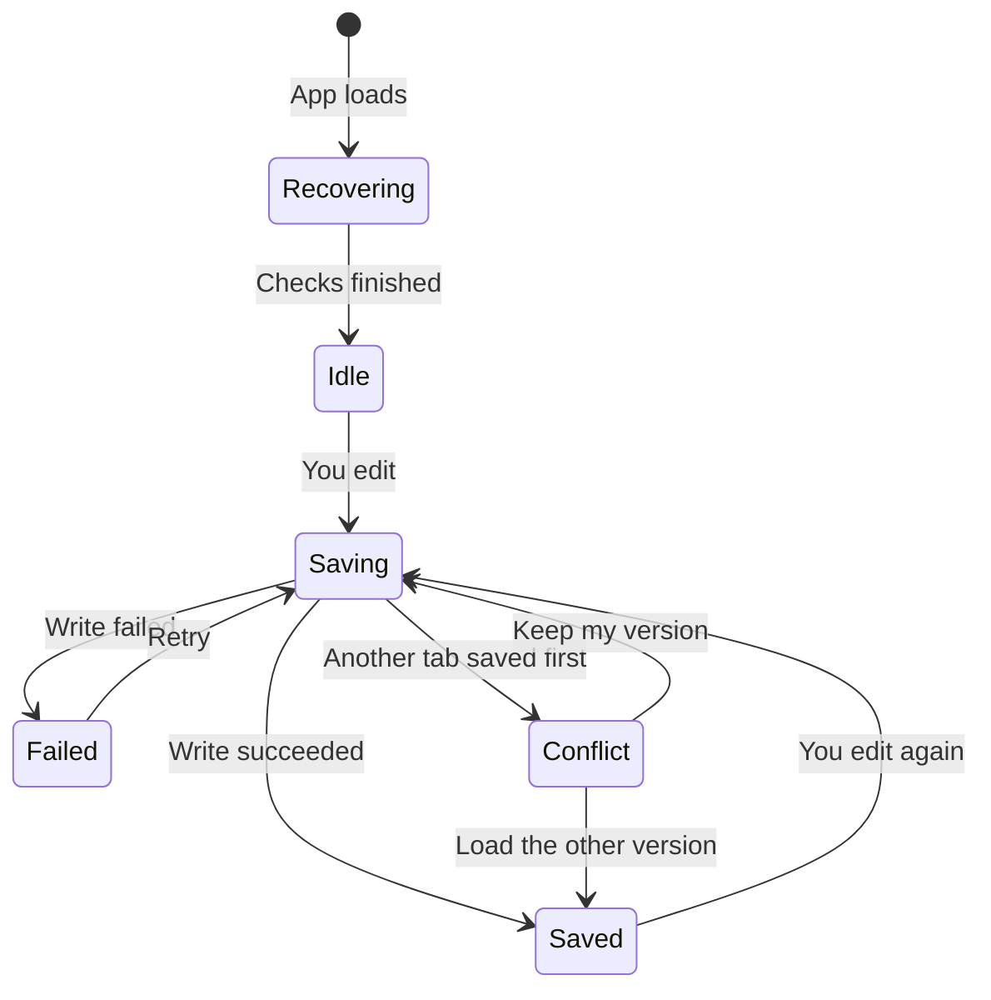
```mermaid
stateDiagram-v2
    [*] --> Recovering: App loads
    Recovering --> Idle: Checks finished
    Idle --> Saving: You edit
    Saving --> Saved: Write succeeded
    Saved --> Saving: You edit again
    Saving --> Failed: Write failed
    Failed --> Saving: Retry
    Saving --> Conflict: Another tab saved first
    Conflict --> Saving: Keep my version
    Conflict --> Saved: Load the other version
```

| Status | Text in the toolbar |
|---|---|
| Recovering | *Recovering previous changes…* |
| Saving | *Saving…* |
| Saved | *All changes saved* (or *Offline · saved on this device*) |
| Failed | *Save failed* + **Retry** |
| Conflict | *Changed in another tab* |
| Memory mode | *Not saved — storage blocked* |

---

## 9. Refresh, Back, and closing the tab

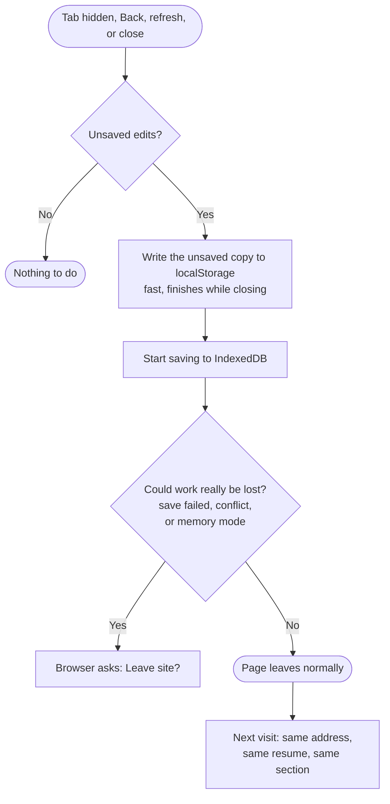
```mermaid
flowchart TD
    A(["Tab hidden, Back, refresh, or close"]) --> B{"Unsaved edits?"}
    B -->|No| OK(["Nothing to do"])
    B -->|Yes| J["Write the unsaved copy to localStorage<br/>fast, finishes while closing"]
    J --> F["Start saving to IndexedDB"]
    F --> W{"Could work really be lost?<br/>save failed, conflict,<br/>or memory mode"}
    W -->|Yes| WARN["Browser asks: Leave site?"]
    W -->|No| GO(["Page leaves normally"])
    GO --> NEXT["Next visit: same address,<br/>same resume, same section"]
```

---

## 10. Recovering unsaved changes

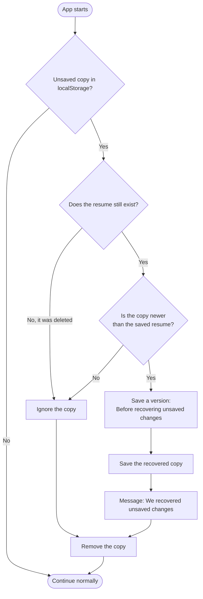
```mermaid
flowchart TD
    A(["App starts"]) --> J{"Unsaved copy in localStorage?"}
    J -->|No| DONE(["Continue normally"])
    J -->|Yes| R{"Does the resume still exist?"}
    R -->|"No, it was deleted"| CLR["Ignore the copy"]
    R -->|Yes| N{"Is the copy newer<br/>than the saved resume?"}
    N -->|No| CLR
    N -->|Yes| V["Save a version:<br/>Before recovering unsaved changes"]
    V --> U["Save the recovered copy"]
    U --> M["Message: We recovered unsaved changes"]
    CLR --> DEL["Remove the copy"]
    M --> DEL
    DEL --> DONE
```

---

## 11. Two tabs editing the same resume

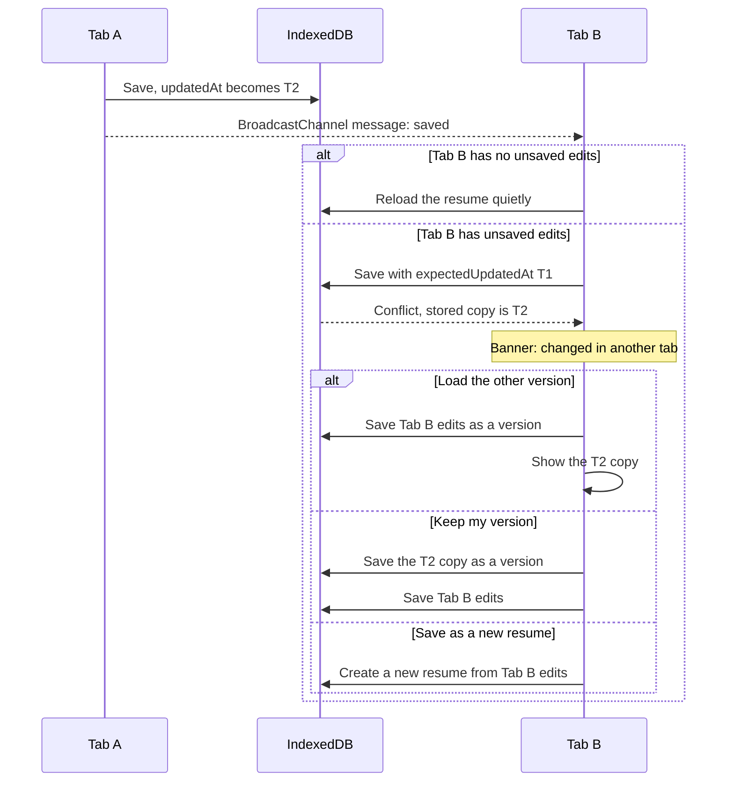
```mermaid
sequenceDiagram
    participant A as Tab A
    participant DB as IndexedDB
    participant B as Tab B

    A->>DB: Save, updatedAt becomes T2
    A-->>B: BroadcastChannel message: saved
    alt Tab B has no unsaved edits
        B->>DB: Reload the resume quietly
    else Tab B has unsaved edits
        B->>DB: Save with expectedUpdatedAt T1
        DB-->>B: Conflict, stored copy is T2
        Note over B: Banner: changed in another tab
        alt Load the other version
            B->>DB: Save Tab B edits as a version
            B->>B: Show the T2 copy
        else Keep my version
            B->>DB: Save the T2 copy as a version
            B->>DB: Save Tab B edits
        else Save as a new resume
            B->>DB: Create a new resume from Tab B edits
        end
    end
```

---

## 12. Version history

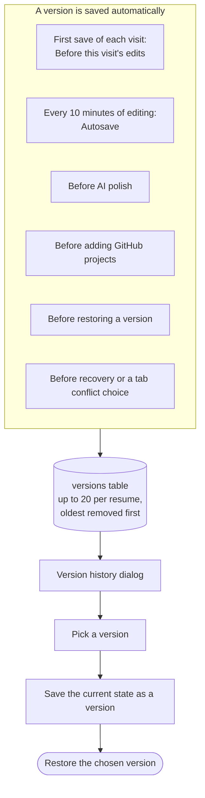
```mermaid
flowchart TD
    subgraph Auto["A version is saved automatically"]
        V1["First save of each visit:<br/>Before this visit's edits"]
        V2["Every 10 minutes of editing:<br/>Autosave"]
        V3["Before AI polish"]
        V4["Before adding GitHub projects"]
        V5["Before restoring a version"]
        V6["Before recovery or a tab conflict choice"]
    end
    Auto --> DB[("versions table<br/>up to 20 per resume,<br/>oldest removed first")]
    DB --> H["Version history dialog"]
    H --> P["Pick a version"]
    P --> S["Save the current state as a version"]
    S --> R(["Restore the chosen version"])
```

---

## 13. Undo and redo

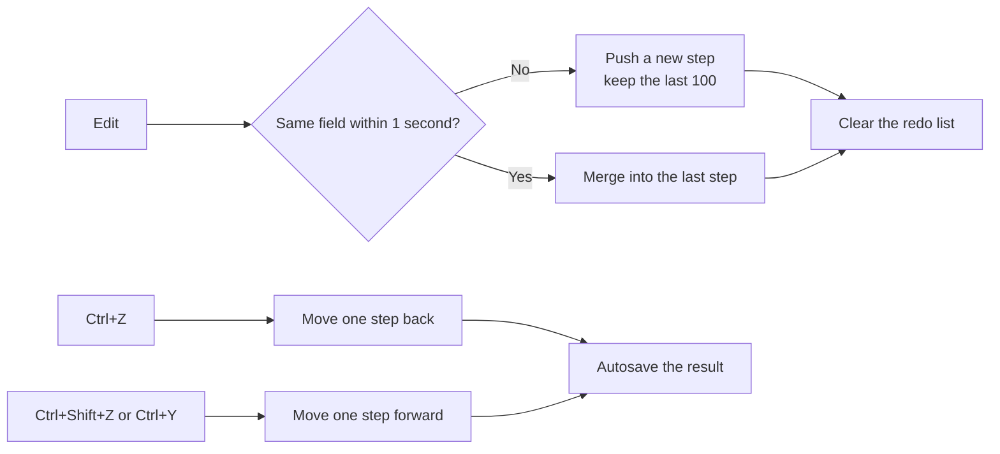
```mermaid
flowchart LR
    E["Edit"] --> Q{"Same field within 1 second?"}
    Q -->|Yes| M["Merge into the last step"]
    Q -->|No| P["Push a new step<br/>keep the last 100"]
    P --> C["Clear the redo list"]
    M --> C
    U["Ctrl+Z"] --> UP["Move one step back"]
    R["Ctrl+Shift+Z or Ctrl+Y"] --> RP["Move one step forward"]
    UP --> SAVE["Autosave the result"]
    RP --> SAVE
```

---

## 14. My Resumes actions

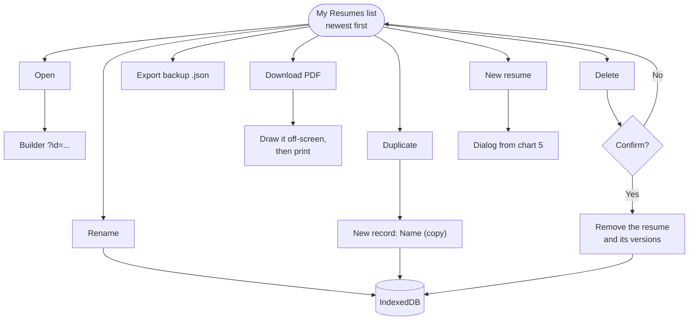
```mermaid
flowchart TD
    L(["My Resumes list<br/>newest first"]) --> O["Open"] --> B["Builder ?id=..."]
    L --> RN["Rename"] --> DB[("IndexedDB")]
    L --> DU["Duplicate"] --> NEW["New record: Name (copy)"] --> DB
    L --> PDF["Download PDF"] --> PR["Draw it off-screen,<br/>then print"]
    L --> EX["Export backup .json"]
    L --> D["Delete"] --> CF{"Confirm?"}
    CF -->|Yes| RM["Remove the resume<br/>and its versions"] --> DB
    CF -->|No| L
    L --> NR["New resume"] --> DLG["Dialog from chart 5"]
```

---

## 15. Backups: export and import

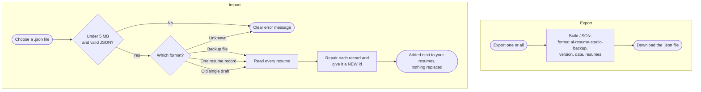
```mermaid
flowchart TD
    subgraph Export
        E1(["Export one or all"]) --> E2["Build JSON:<br/>format ai-resume-studio-backup,<br/>version, date, resumes"]
        E2 --> E3(["Download the .json file"])
    end
    subgraph Import
        I1(["Choose a .json file"]) --> I2{"Under 5 MB<br/>and valid JSON?"}
        I2 -->|No| IE(["Clear error message"])
        I2 -->|Yes| I3{"Which format?"}
        I3 -->|"Backup file"| I4["Read every resume"]
        I3 -->|"One resume record"| I4
        I3 -->|"Old single draft"| I4
        I3 -->|"Unknown"| IE
        I4 --> I5["Repair each record and<br/>give it a NEW id"]
        I5 --> I6(["Added next to your resumes,<br/>nothing replaced"])
    end
```

---

## 16. Moving the old single draft

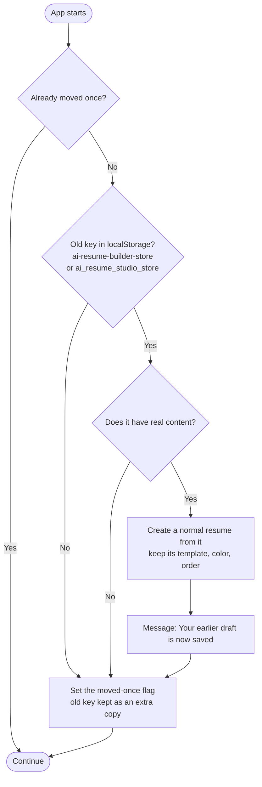
```mermaid
flowchart TD
    A(["App starts"]) --> F{"Already moved once?"}
    F -->|Yes| DONE(["Continue"])
    F -->|No| K{"Old key in localStorage?<br/>ai-resume-builder-store<br/>or ai_resume_studio_store"}
    K -->|No| FLAG
    K -->|Yes| C{"Does it have real content?"}
    C -->|No| FLAG
    C -->|Yes| N["Create a normal resume from it<br/>keep its template, color, order"]
    N --> MSG["Message: Your earlier draft is now saved"]
    MSG --> FLAG["Set the moved-once flag<br/>old key kept as an extra copy"]
    FLAG --> DONE
```

---

## 17. Sections: order, hide, and draw

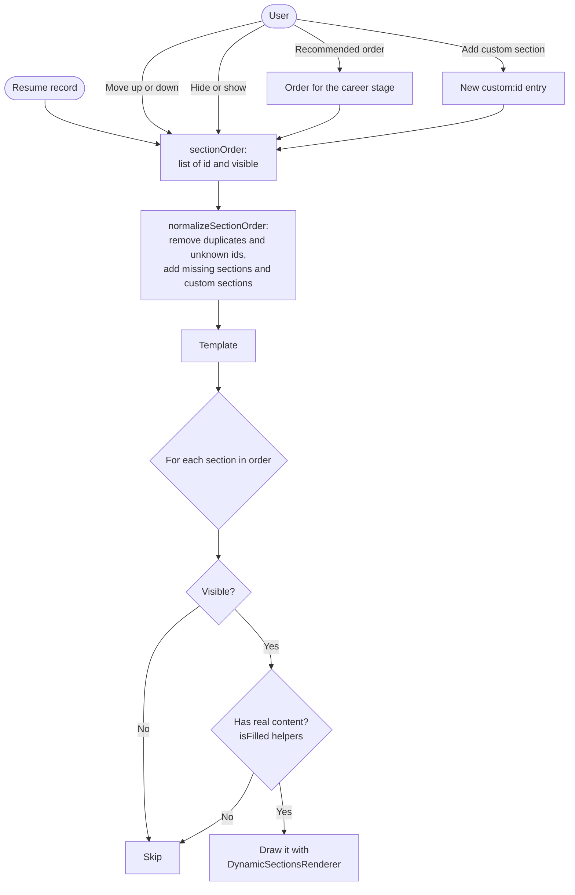
```mermaid
flowchart TD
    A(["Resume record"]) --> O["sectionOrder:<br/>list of id and visible"]
    O --> N["normalizeSectionOrder:<br/>remove duplicates and unknown ids,<br/>add missing sections and custom sections"]
    N --> T["Template"]
    T --> L{"For each section in order"}
    L --> V{"Visible?"}
    V -->|No| SKIP["Skip"]
    V -->|Yes| H{"Has real content?<br/>isFilled helpers"}
    H -->|No| SKIP
    H -->|Yes| DRAW["Draw it with<br/>DynamicSectionsRenderer"]

    U(["User"]) -->|"Move up or down"| O
    U -->|"Hide or show"| O
    U -->|"Recommended order"| R["Order for the career stage"] --> O
    U -->|"Add custom section"| CS["New custom:id entry"] --> O
```

---

## 18. Importing a PDF resume

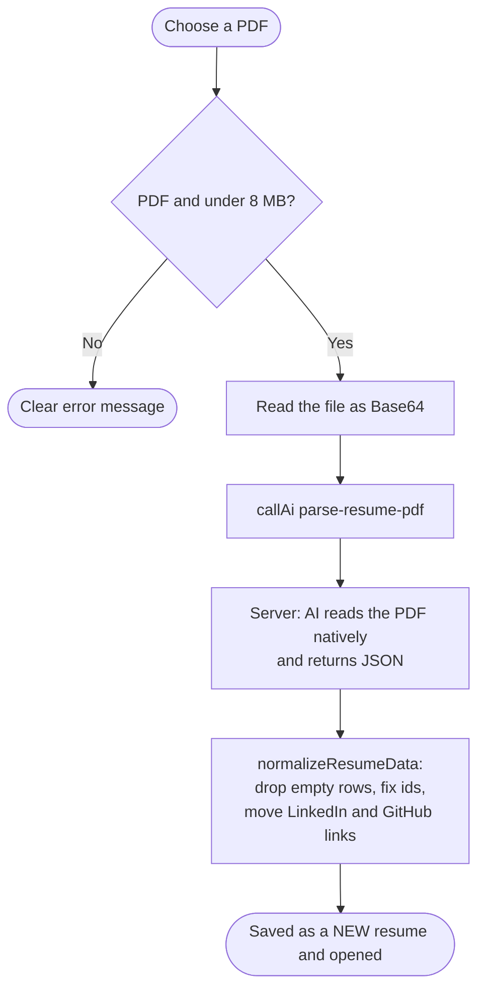
```mermaid
flowchart TD
    A(["Choose a PDF"]) --> B{"PDF and under 8 MB?"}
    B -->|No| E(["Clear error message"])
    B -->|Yes| C["Read the file as Base64"]
    C --> D["callAi parse-resume-pdf"]
    D --> S["Server: AI reads the PDF natively<br/>and returns JSON"]
    S --> N["normalizeResumeData:<br/>drop empty rows, fix ids,<br/>move LinkedIn and GitHub links"]
    N --> NEW(["Saved as a NEW resume and opened"])
```

Import works from the create form and from the Builder's **More actions** menu (*Import a PDF as a new resume*). Either way the resume that is open is **not changed**. Missing sections in the PDF stay **empty**; the AI is told not to guess them.

---

## 19. Downloading the PDF

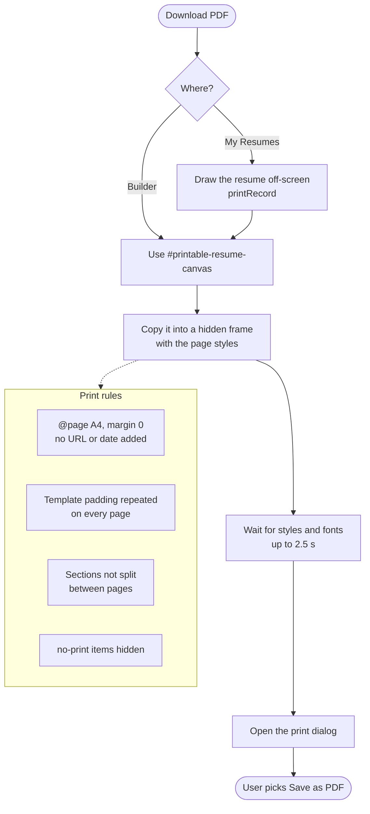
```mermaid
flowchart TD
    A(["Download PDF"]) --> W{"Where?"}
    W -->|"Builder"| C["Use #printable-resume-canvas"]
    W -->|"My Resumes"| R["Draw the resume off-screen<br/>printRecord"] --> C
    C --> F["Copy it into a hidden frame<br/>with the page styles"]
    F --> L["Wait for styles and fonts<br/>up to 2.5 s"]
    L --> P["Open the print dialog"]
    P --> S(["User picks Save as PDF"])

    subgraph Rules["Print rules"]
        R1["@page A4, margin 0<br/>no URL or date added"]
        R2["Template padding repeated<br/>on every page"]
        R3["Sections not split<br/>between pages"]
        R4["no-print items hidden"]
    end
    F -.-> Rules
```

---

## 20. AI suggestion approval

Every AI writing feature follows this pattern. Nothing changes until you accept.

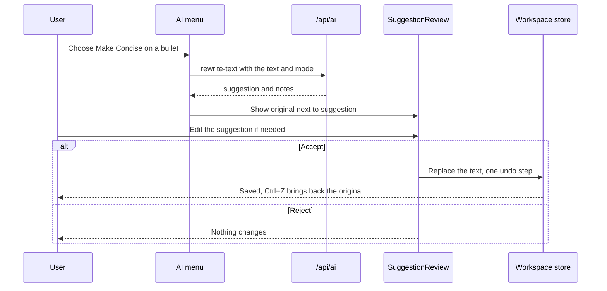
```mermaid
sequenceDiagram
    participant U as User
    participant M as AI menu
    participant API as /api/ai
    participant R as SuggestionReview
    participant S as Workspace store

    U->>M: Choose Make Concise on a bullet
    M->>API: rewrite-text with the text and mode
    API-->>M: suggestion and notes
    M->>R: Show original next to suggestion
    U->>R: Edit the suggestion if needed
    alt Accept
        R->>S: Replace the text, one undo step
        S-->>U: Saved, Ctrl+Z brings back the original
    else Reject
        R-->>U: Nothing changes
    end
```

The seven modes: Improve Writing, Make Concise, Make Professional, Fix Grammar, Improve Clarity, Rewrite as Achievement, Add Relevant Keywords.

---

## 21. AI polish for the whole resume

```mermaid
flowchart TD
    A(["AI polish"]) --> B["callAi optimize-resume"]
    B --> C["Compare each summary, bullet,<br/>and project description by id"]
    C --> D["List of changes:<br/>original and suggestion"]
    D --> E{"For each change"}
    E -->|Accept| AC["Mark accepted"]
    E -->|Reject| RJ["Mark rejected"]
    AC --> APPLY
    RJ --> APPLY
    APPLY["Apply accepted changes"] --> V["Save a version first:<br/>Before AI polish"]
    V --> M["Merge onto the CURRENT resume by id<br/>edits made while waiting are kept"]
    M --> DONE(["Saved, one undo step"])
```

---

## 22. Resume Analyzer

```mermaid
flowchart TD
    START(["Resume to analyze"]) --> SRC{"Saved or upload?"}
    SRC -->|"Saved resume"| A["Pick one of your resumes"]
    SRC -->|"Upload a PDF"| UP["callAi parse-resume-pdf"]
    UP --> UPS["Choose Score it as:<br/>first guess from the PDF"]
    UPS --> A2["Not saved: no Fix buttons yet"]
    A2 --> SAVE{"Save as a resume?"}
    SAVE -->|Yes| NEWR["createResume: a NEW resume,<br/>then it is analyzed as a saved one"]
    NEWR --> A
    A --> R["analyzeResume: rules in the browser,<br/>instant, no AI"]
    A2 --> R
    R --> ST{"Career stage"}
    ST -->|"Student or Fresher"| F["Projects and education count,<br/>no penalty for no job"]
    ST -->|"Experienced"| X["Work history expected"]
    F --> S
    X --> S
    S["Six categories, 100 points:<br/>Contact 15, Summary 10, Skills 15,<br/>Experience and projects 35,<br/>Education 15, Formatting 10"]
    S --> L["Label: Ready to send, Strong,<br/>Getting there, Needs work"]
    S --> I["Issues sorted by severity:<br/>why it matters, how to fix"]
    I --> FIX["Fix button, saved resumes only"] --> B(["Builder at that section"])
    R --> AIQ["Optional: AI review"] --> AIR["callAi analyze-resume:<br/>grammar, clarity, relevance notes"]
```

---

## 23. Job Matcher and the tailored copy

```mermaid
flowchart TD
    A(["Choose a resume or upload a PDF"]) --> J["Add the job description: paste,<br/>.txt, or PDF via read-job-pdf<br/>80 to 30,000 characters"]
    J --> M["callAi match-job"]
    M --> R["Results: match estimate, required and<br/>preferred skills, evidence, keyword gaps,<br/>project alignment, three fit checks"]
    R --> G{"All three checks pass?"}
    G -->|No| EXP(["Explain which check failed and why.<br/>No tailoring offered."])
    G -->|Yes| T["Create tailored version"]
    T --> TR["callAi tailor-resume with the token"]
    TR --> N["normalizeResumeData"]
    N --> NEW["createResume: NEW record<br/>Title - Job title<br/>sourceResumeId and tailoredFor set"]
    NEW --> MSG(["Message: Created. Your original<br/>resume was not changed. Open?"])
```

---

## 24. The permission token

```mermaid
sequenceDiagram
    participant C as Browser
    participant S as /api/ai
    participant AI as AI provider

    C->>S: match-job with resume and job description
    S->>AI: Analyze with the three fit checks
    AI-->>S: Result and checks
    alt All checks pass
        S->>S: Sign a token with HMAC,<br/>tied to this resume and job, 15 minutes
        S-->>C: Result and token
        C->>S: tailor-resume with the token
        S->>S: Check signature, time, resume, and job
        alt Token valid
            S->>AI: Tailor using only facts in the resume
            AI-->>S: Tailored resume
            S-->>C: Tailored resume
        else Token missing, expired, or changed
            S-->>C: 403, run the analysis again
        end
    else A check fails
        S-->>C: Result with no token
    end
```

---

## 25. GitHub Projects

```mermaid
sequenceDiagram
    participant U as User
    participant P as GitHub page
    participant G as /api/github
    participant API as GitHub API
    participant AI as /api/ai

    U->>P: Enter a username
    P->>G: GET username
    G->>API: List public repositories
    API-->>G: Repositories
    G-->>P: Up to 100, newest first
    U->>P: Pick up to 6 repositories
    loop For each repository
        P->>G: GET owner and repo
        G->>API: Languages and README
        G-->>P: Languages and README, first 8,000 characters
        P->>AI: describe-project
        AI-->>P: Title, description, tech stack from README only
    end
    P->>U: Show each draft: edit it, or untick it
    U->>P: Choose a resume and add
    P->>P: Save a version: Before adding GitHub projects
    P->>P: Add projects with Code and Live links
```

---

## 26. Interview Prep

```mermaid
flowchart TD
    A(["1. Your resume"]) --> AS{"Saved or upload?"}
    AS -->|"Saved"| RES["Resume data"]
    AS -->|"Upload a PDF"| RP["callAi parse-resume-pdf"] --> RES
    J(["2. The job, optional"]) --> JS{"Paste or upload?"}
    JS -->|"Paste"| JD["Job description text"]
    JS -->|".txt file"| JD
    JS -->|"PDF"| JP["callAi read-job-pdf:<br/>copied word for word"] --> JD
    RES --> Q["callAi interview-questions<br/>with types and count"]
    JD --> Q
    Q --> HAS{"Job description given?"}
    HAS -->|Yes| QJ["Questions test job requirements.<br/>Label: On your resume, Partly, or Not on your resume"]
    HAS -->|No| QR["Questions from your resume<br/>and target role"]
    QJ --> CODE{"Role involves writing code<br/>and Coding is ticked?"}
    QR --> CODE
    CODE -->|Yes| CQ["Up to 3 coding questions,<br/>each with sample code and complexity"]
    CODE -->|No| NC["No coding questions,<br/>the page says why"]
    CQ --> L["Question cards"]
    NC --> L
    L --> SA["Show a sample answer and code:<br/>hidden until you ask, Copy button"]
    L --> P["Type an answer or code"]
    P --> F["callAi interview-feedback<br/>same resume and job"]
    F --> R["Ratings 1 to 5: accuracy, clarity,<br/>completeness, communication"]
    R --> S["Strengths, improvements,<br/>outline of a better answer"]
    S --> P
```

---

## 27. Inside the AI route

```mermaid
flowchart TD
    A(["POST /api/ai"]) --> SZ{"Body over 13 MB?"}
    SZ -->|Yes| E413(["413: request too large"])
    SZ -->|No| J{"Valid JSON?"}
    J -->|No| E400(["400: invalid request"])
    J -->|Yes| ACT{"Known action?"}
    ACT -->|No| E400
    ACT -->|Yes| FE{"Feature enabled<br/>for this plan?"}
    FE -->|No| E403(["403: not available"])
    FE -->|Yes| RL{"Under the rate limit?"}
    RL -->|No| E429(["429: friendly message<br/>and wait time"])
    RL -->|Yes| V{"Action fields valid?"}
    V -->|No| E400
    V -->|Yes| P["Build the prompt with the<br/>evidence-only rules"]
    P --> CALL["Call the AI provider<br/>JSON mode when needed"]
    CALL --> CL["extractCleanJson"]
    CL --> OK(["200: result"])
    CALL -->|"Provider failed"| E5(["Clear error,<br/>no resume text logged"])
```

---

## 28. Rate limits

```mermaid
flowchart TD
    A(["Request from a visitor"]) --> K["Key: route name and visitor IP"]
    K --> M{"Requests in the last minute<br/>under the limit?<br/>AI 10, GitHub 20"}
    M -->|No| WM(["429: wait a few seconds"])
    M -->|Yes| D{"Requests today<br/>under the limit?<br/>AI 150, GitHub 300"}
    D -->|No| WD(["429: today's free requests used,<br/>editing still works"])
    D -->|Yes| OK(["Count it and continue"])
```

AI limits can be changed with `AI_RATE_LIMIT_PER_MINUTE` and `AI_RATE_LIMIT_PER_DAY`. Counts are kept in the server's memory, per server instance.

---

## 29. AI model retry and fallback

```mermaid
flowchart TD
    A(["Call the main model<br/>gemini-3.8-flash"]) --> B{"Result"}
    B -->|Success| OK(["Return the answer"])
    B -->|500 or 503 busy| C{"Retries left? max 2"}
    C -->|Yes| D["Wait 500 ms, then 1 s"] --> A
    C -->|No| F
    B -->|404 or 429: model missing or no quota| F["Switch to the fallback model<br/>gemini-3.1-flash-lite"]
    B -->|Other error| ERR(["Stop and report the error"])
    F --> G{"Result"}
    G -->|Success| OK
    G -->|Busy| H{"Retries left?"}
    H -->|Yes| I["Wait and retry"] --> F
    H -->|No| ERR
    G -->|Other error| ERR
```

With `AI_PROVIDER=openrouter`, the same idea applies: the main OpenRouter model first, then each backup model in `OPENROUTER_FALLBACK_MODELS`. The Analyzer, Job Matcher, and Interview Prep can each have their own model first:

```mermaid
flowchart TD
    A(["AI request from a tool"]) --> O{"Tool has its own model?<br/>OPENROUTER_MODEL_ANALYZER,<br/>_JOB_MATCH, _INTERVIEW"}
    O -->|No| MAIN["Ask OPENROUTER_MODEL<br/>then the backup list"]
    O -->|Yes| OWN["Ask the tool's model,<br/>main model listed as backup"]
    OWN --> R{"Refuses to turn<br/>reasoning off?"}
    R -->|Yes| LOW["Retry with short hidden reasoning<br/>and remember this model"] --> OK
    R -->|No| OK{"Usable JSON<br/>within 25 s?"}
    OK -->|Yes| DONE(["Answer"])
    OK -->|No| MAIN
    MAIN --> DONE
```

➡️ Next: **[5. Directory Map](./05-DIRECTORY-MAP.md)**
